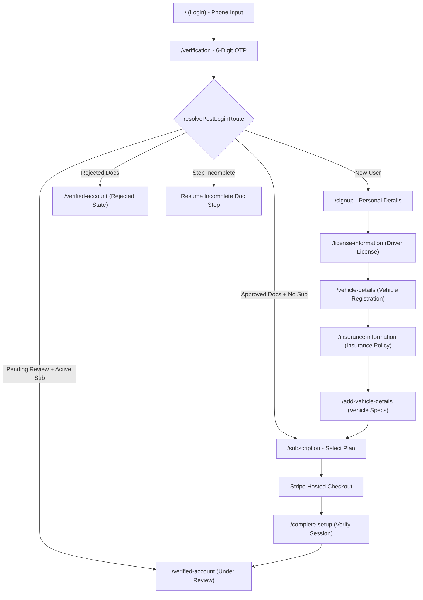

# Epic Rides Web Application — Comprehensive Codebase & Architecture Guide

## 1. Executive Summary & Core Mission

**Epic Rides Web App** is a driver-facing and passenger-tracking web portal for the Epic Rides ride-hailing and carpooling platform. The web application serves two distinct, decoupled production surfaces:

1. **Driver Onboarding & Verification Wizard (`/`, `/signup`, `/license-information`, ... `/verified-account`)**
   - End-to-end registration flow for new drivers.
   - Phone-based One-Time Password (OTP) authentication.
   - Multi-step document submission wizard (License, Registration, Insurance, Vehicle Details).
   - Real-time Florida-restricted location autofill via Google Places.
   - Automated routing based on server-verified document approval/rejection states.
   - Stripe Subscription Checkout integration for recurring driver platform memberships.
   - Real-time status polling for administrative account verification.

2. **Public Live Ride & Carpool Tracking (`/share`)**
   - Zero-authentication, public-facing live GPS tracking portal opened via shared URLs.
   - Real-time, bi-directional WebSocket telemetry via Socket.IO.
   - High-precision Google Maps rendering featuring dynamic camera tracking, route polylines, and rotated vehicle markers.
   - Specialized dispatch logic separating single-passenger rides and multi-passenger carpool journeys.
   - Terminal state resolution handling (`/ride-ended`, `/ride-cancelled`, `/ride-not-found`).

---

## 2. Technology Stack & Dependencies

### Core Frameworks & Runtime
- **React**: `v19.2.4` (Modern concurrent React with functional components and hooks).
- **Vite**: `v6.1.1` (Fast ESM build tool and development server).
- **React Router**: `v7.2.0` (Imported from `"react-router"` for declarative routing).

### State Management & Persistence
- **Redux Toolkit**: `v2.11.2` (`createSlice`, `createAsyncThunk`, `configureStore`).
- **React-Redux**: `v9.2.0` (`useDispatch`, `useSelector`).
- **Redux-Persist**: `v6.0.0` (Persists Redux `auth` slice to `localStorage` under key `root`).
- **js-cookie**: `v3.0.5` (Cross-origin session persistence for JWT `token` and `user` JSON with 7-day expiration).

### Networking, Real-Time & Device Intelligence
- **Axios**: `v1.7.9` (Configured singleton instance with request/response interceptors).
- **Socket.IO Client**: `v4.8.3` (WebSocket transport for real-time driver GPS telemetry and ride state updates).
- **FingerprintJS**: `v4.6.0` (`@fingerprintjs/fingerprintjs` for browser visitor identification).

### Maps & Geolocation
- **Google Maps JavaScript API**: Loaded imperatively via custom script loader (`loadGoogleMapsPlaces.js`) and direct `AdvancedMarkerElement` / `Map` instantiation.
- **@react-google-maps/api**: `v2.20.8`.

### UI, Styling & Modals
- **Tailwind CSS**: `v3.4.17` with PostCSS and Autoprefixer.
- **Custom Fonts**: Poppins (primary brand font) and Inter via Google Fonts.
- **React Hot Toast**: `v2.5.2` (Enforced singleton toast notifications via `Toaster.jsx`).
- **React Modal**: `v3.16.3` (Accessible dialogs with blurred backdrop overlays).
- **Icons**: Lucide React (`v0.563.0`), React Icons (`v5.5.0`), Tabler Icons (`v3.30.0`).

---

## 3. Directory Structure & Anatomy

```
Epic-Rides-Web-App/
├── public/                     # Static assets, favicon
├── src/
│   ├── assets/                 # SVGs, car illustrations, badges, flags, logos
│   │   ├── cars/               # Vehicle silhouettes (sedan, SUV, trackingcar, trackcar2)
│   │   ├── login/              # Login background imagery, US flag asset
│   │   ├── signup/             # Stepper indicator assets (barone, bartwo, barthree)
│   │   └── export.js           # Central asset export hub
│   ├── components/
│   │   ├── authentication/     # Onboarding UI: SignupSidebar, SignupBackground
│   │   ├── global/             # Modal dialogs (Logout, NumberVerified, Card, Legal), Toaster, ImageFileInputs
│   │   └── layout/             # Template remnants: DummyNavbar, DummySidebaar
│   ├── lib/                    # Shared utility helpers (processError, processLogin, etc.)
│   ├── pages/
│   │   ├── authentication/     # Core onboarding & auth pages
│   │   │   ├── Login.jsx                 # Step 0: Phone input
│   │   │   ├── Verification.jsx          # Step 0b: 6-digit OTP verification & route dispatcher
│   │   │   ├── Signup.jsx                # Wizard Step 1: Personal profile & Florida address
│   │   │   ├── LicenseInformation.jsx    # Wizard Step 2: Driver's license front/back & number
│   │   │   ├── VehicleDetails.jsx        # Wizard Step 3: Vehicle registration document
│   │   │   ├── InsuranceInformation.jsx  # Wizard Step 4: Auto insurance document front/back
│   │   │   ├── AddVehicleDetails.jsx     # Wizard Step 5: Vehicle make, model, VIN, plate, year
│   │   │   ├── Subscription.jsx          # Wizard Step 6: Platform membership plan selection
│   │   │   ├── Completesetup.jsx         # Stripe return handler & session verifier
│   │   │   └── VerifiedAccount.jsx       # Wizard Step 7: Account review & rejected resubmit hub
│   │   ├── tracking/           # Public real-time tracking pages
│   │   │   ├── ShareTracking.jsx         # Dispatcher: determines ride vs. carpool mode
│   │   │   ├── RideTracking.jsx          # Dedicated single-passenger live tracking
│   │   │   ├── CarpoolShare.jsx          # Multi-stop carpool live tracking
│   │   │   ├── RideEnded.jsx             # Ride completion / cancellation animated celebration
│   │   │   ├── RideCancelled.jsx         # Standalone ride cancellation notice
│   │   │   └── RideNotFound.jsx          # 404 / expired ride handler
│   │   ├── app/                # Template remnant: DummyHome
│   │   └── NotFound.jsx        # Global 404 handler with animated sci-fi backdrop
│   ├── redux/
│   │   ├── slices/
│   │   │   ├── auth.slice.jsx            # All auth thunks, document uploads, and session actions
│   │   │   └── vehicleTypes.slice.jsx    # Vehicle category list thunk & state
│   │   └── store.jsx           # Redux configureStore with redux-persist
│   ├── utils/
│   │   ├── imageFileInput.js             # Mobile camera vs gallery picker helper
│   │   ├── loadGoogleMapsPlaces.js       # Dynamic script injector for Google Places
│   │   ├── onboardingRedirect.js         # Server-truth routing engine & document state evaluator
│   │   ├── rejectedFlowPrefill.js        # Re-fetches rejected documents from S3 for prefilling
│   │   ├── stepValidation.js             # LocalStorage client stepper guard & route order
│   │   └── subscriptionCheckout.js       # Stripe session storage & driver ID resolver
│   ├── App.jsx                 # Master application routing table
│   ├── axios.js                # Singleton axios instance, baseUrl configuration, interceptors
│   ├── index.css               # Tailwind directives, custom scrollbars, Google autocomplete styles
│   └── main.jsx                # React root mount point with Redux Provider and Toaster
├── CLAUDE.md                   # Quick developer guide for agent interactions
├── Epic Rides.postman_collection 9.json  # Comprehensive backend API collection
├── eslint.config.js            # ESLint flat configuration
├── tailwind.config.js          # Tailwind styling tokens (Poppins, Inter)
├── vercel.json                 # Vercel SPA rewrite rule
└── vite.config.js              # Vite build configuration
```

> **Note on Template Remnants**: Directories `src/pages/app`, `src/layouts`, `src/components/layout`, `src/context`, `src/firebase`, `src/hooks/api`, `src/init`, and `src/schema` are boilerplate artifacts inherited from a base starter kit. They are not active in the production onboarding or tracking flows.

---

## 4. Network & API Architecture (`src/axios.js`)

### Base URL Environment Management
The API base URL is declared as an exported constant at the top of [src/axios.js](file:///c:/Users/Muhammad%20Kamil%20Raza/Desktop/KamilRaza/Projects/EpicRides/Epic-Rides-Web-App/src/axios.js):
```javascript
// export const baseUrl = "https://api.dev.epicridesapp.com";
export const baseUrl = "https://api.staging.epicridesapp.com";
// export const baseUrl = "https://api.epicridesapp.com";
```
*Notice: The backend endpoint is hardcoded here rather than loaded via `import.meta.env.VITE_...`. Changing environments requires switching the active comment.*

### Request Interceptor
Because the frontend and backend run on different domains, cookies cannot be sent automatically. The request interceptor inspects `Cookies.get("token")` and injects the HTTP `Authorization` header:
```javascript
instance.interceptors.request.use((config) => {
  const token = Cookies.get("token");
  if (token) {
    config.headers.Authorization = `Bearer ${token}`;
  }
  return config;
});
```

### Response Interceptor & 401 Session Handling
1. **Network & Timeout Errors**: Catches `ECONNABORTED`, `ETIMEDOUT`, or offline events (`!navigator.onLine`) and triggers single-instance notifications via `ErrorToast`.
2. **401 Unauthorized Protection**:
   - An onboarding route whitelist prevents kicking out drivers during registration:
     `['/signup', '/license-information', '/vehicle-details', '/insurance-information', '/add-vehicle-details', '/subscription', '/verified-account', '/verification', '/complete-setup']`
   - Alternatively, requests specifying `{ skipAuthRedirect: true }` ignore 401 redirects.
   - For all other requests, cookies (`token`, `user`) are cleared, and the user is redirected to `/`.

---

## 5. State Management & Authentication Flow

### Session State Triplication
Session state is maintained across three separate storage mediums:
1. **HTTP Cookies (`js-cookie`)**: `token` (JWT string) and `user` (serialized JSON object) with a 7-day TTL. This serves as the source of truth across browser tabs and reloads.
2. **Redux Persist Store (`src/redux/store.jsx`)**: The `auth` slice is stored in `localStorage` under `persist:root`. Action `hydrateAuthFromCookies` synchronizes Redux with cookies whenever the Redux store is unpopulated.
3. **Storage Utilities (`sessionStorage` & `localStorage`)**:
   - `localStorage.verifiedPhone`: Set upon OTP verification.
   - `localStorage.completedSteps`: Tracks client-side step completion.
   - `sessionStorage.pendingStripeCheckout`: Preserves wizard state across the Stripe checkout external redirect.

### Core Redux Thunks (`src/redux/slices/auth.slice.jsx`)

| Thunk Name | HTTP Route | Payload / FormData | Purpose |
|---|---|---|---|
| `sendOtp` | `POST /api/auth/send-otp` | `{ phone, role: "driver" }` | Requests 6-digit SMS verification code |
| `verifyOtp` | `POST /api/auth/verify-otp` | `{ phone, otp, role: "driver" }` | Validates code, stores token & user in cookies |
| `onboard` | `POST /api/auth/onboard/driver` | `FormData` (file, name, email, phone, ssn, address, city, state, referredBy) | Creates initial driver profile |
| `uploadDriverDocuments` | `POST /api/auth/onboard/driver/:id/documents?step=1` | `FormData` (files [front, back], licenseNumber, expiryDate) | Uploads Driver License images and metadata |
| `uploadVehicleRegistrationDocuments` | `POST /api/auth/onboard/driver/:id/documents?step=2` | `FormData` (files [front]) | Uploads Vehicle Registration document |
| `uploadInsuranceDocuments` | `POST /api/auth/onboard/driver/:id/documents?step=3` | `FormData` (files [front, back]) | Uploads Auto Insurance policy documents |
| `uploadVehicleDetails` | `POST /api/auth/onboard/driver/:id/documents?step=4` | `FormData` (make, model, yearOfManufacture, color, VIN, licensePlateNumber, regionOfRegistration, expiryDate, vehicleType) | Uploads vehicle specifications |

---

## 6. Driver Onboarding Wizard Specification

### Document Status Model
Each document (`driverLicense`, `vehicleRegistration`, `insurance`, `vehicleDetails`) possesses one of four distinct states:
- `absent`: Never uploaded.
- `pending`: Uploaded by driver; currently undergoing administrative review.
- `approved`: Reviewed and accepted by admin.
- `rejected`: Rejected by admin; contains `rejectReason` requiring resubmission.

### Sequential Step Architecture



### Detailed Step Matrix

1. **Step 1: Your Details (`/signup`)**
   - Profile picture with mobile camera / gallery pickers.
   - Name sanitization (alphabetic only, max 15 chars).
   - Strict Florida address restriction:
     - Google Places Autocomplete biased to Florida geographic bounding box (`24.396308, -87.634938` to `31.000968, -79.974306`).
     - Rejects addresses outside Florida (e.g. "Florida, NY").
     - Autofills city and state; locks city/state when selected via Google Places.
   - US SSN formatting (`XXX-XX-XXXX`).
   - Referral tracking from query parameters (`?referredBy=...`) saved to cookies.

2. **Step 2: License Information (`/license-information`)**
   - Front and back driver license images (Max 5MB; JPG, PNG, HEIC, WEBP).
   - License Number (6-15 alphanumeric characters).
   - Future expiry date validation.

3. **Step 3: Vehicle Registration (`/vehicle-details`)**
   - Official state vehicle registration document photo.

4. **Step 4: Insurance Information (`/insurance-information`)**
   - Auto insurance certificate (front and back documentation).

5. **Step 5: Vehicle Details (`/add-vehicle-details`)**
   - Dynamic vehicle categories fetched from `GET /api/admin/vehicle-types`.
   - Vehicle Make, Model, Color, Year of Manufacture (must be within the last 15 years).
   - 17-character VIN verification (excludes letters I, O, Q).
   - License Plate formatting and registration expiration date.

6. **Step 6: Subscription (`/subscription`)**
   - Fetches available plans from `GET /api/plan`.
   - Purchases via `POST /api/subscription/purchase/:planId/:driverId`.
   - Dispatches to Stripe Checkout.

7. **Step 7: Verification & Status Hub (`/verified-account`)**
   - Polls `GET /api/auth/account-status/:driverId` every 10 seconds.
   - **Submitted state**: Renders "Your profile is under review" screen with animated timer.
   - **Rejected state**: Parses `rejectedDocuments`, displays formatted rejection reasons, and renders "Resubmit Documents".
   - **Resubmission flow**: Uses `mergeRejectedDocumentsForResubmit` and `fetchUrlAsFile` to prefill unchanged data from remote S3 URLs while drivers update rejected files.

---

## 7. Real-Time Ride & Carpool Tracking Subsystem

The tracking subsystem is accessible publicly via `/share` without authentication.

### Dispatcher (`src/pages/tracking/ShareTracking.jsx`)
Inspects query parameters:
- If `?carpool=...` exists: Mounts `CarpoolShare.jsx`.
- Otherwise: Mounts `RideTracking.jsx`.

### Socket.IO Protocol & Event Architecture
Both tracking interfaces connect using the WebSocket transport:
```javascript
io(baseUrl, {
  transports: ["websocket"],
  query: {
    origin: "web",
    rideId: "...",            // In RideTracking
    carpoolId: "...",         // In CarpoolShare
    passengerId: "...",       // In CarpoolShare
  }
});
```

#### Shared Socket Events

| Socket Event | Direction | Payload Structure | Action |
|---|---|---|---|
| `ride:initial_data` / `carpool:initial_data` | Server → Client | `{ data: { ride/carpool } }` | Sets up ride waypoints, driver info, and passenger list |
| `ride:status:update` / `carpool:status:update` | Server → Client | `{ rideStatus: string }` | Updates badge; navigates to `/ride-ended` on completion |
| `driver:location:update` | Server → Client | `{ coordinates: [lng, lat] }` | Updates live vehicle position and rotates car marker |
| `ride:error` / `carpool:error` | Server → Client | `{ message: string }` | Triggers error toast and redirects to `/ride-not-found` |
| `carpool:passenger:pickup:confirmed` | Server → Client | Passenger-specific pickup event | Marks passenger as `picked_up` |
| `carpool:passenger:dropped_off` | Server → Client | Passenger-specific dropoff event | Updates individual passenger progress |

### Map Rendering & Animation Pipeline
- **Vector Maps**: Uses Google Maps with `mapId` (`VITE_GOOGLE_MAP_ID`).
- **Vehicle Heading Calculation**: Computes bearing between previous coordinates and incoming GPS coordinates:
  $$\theta = \text{atan2}(\sin(\Delta \lambda) \cdot \cos(\phi_2), \cos(\phi_1) \cdot \sin(\phi_2) - \sin(\phi_1) \cdot \cos(\phi_2) \cdot \cos(\Delta \lambda))$$
- Smoothly animates heading transitions using `requestAnimationFrame`.
- Displays real-time route path connecting pickup, journey points, driver position, and destination.

---

## 8. Current Health, Linter Report & Known Technical Debt

### ESLint Status Audit
Running `npm run lint` identifies 120 issues (109 errors, 11 warnings):
1. **Unescaped Quotes in JSX (`react/no-unescaped-entities`)**:
   - Quotes in strings like `"` or `'` inside JSX tags in `LicenseInformation.jsx`, `AddVehicleDetails.jsx`, `Verification.jsx`.
2. **React 19 Unused Import (`no-unused-vars`)**:
   - `import React from 'react';` flagged across components where JSX transform is active.
3. **Dead / Unused Variables**:
   - `countryCode` in `Login.jsx`
   - `Check`, `isStepCompleted` in `Subscription.jsx`
   - `handleBack` in `VehicleDetails.jsx`
   - `ChevronLeft` in `Verification.jsx`
   - `Phone`, `MessageCircle`, `furtherCarpoolStatus` in `CarpoolShare.jsx`
4. **Regular Expression Warnings in `Signup.jsx`**:
   - `no-useless-escape`: Unnecessary escape of `/` on line 22.
   - `no-misleading-character-class`: Emoji character range regex on line 23.
5. **Base URL Configuration**:
   - Currently hardcoded in `src/axios.js` rather than parameterized through `import.meta.env.VITE_API_URL`.

---

## 9. Developer Onboarding Cheat Sheet

### Essential Commands
```bash
# Start Vite development server (port 5173)
npm run dev

# Compile production bundle to /dist
npm run build

# Run ESLint across codebase
npm run lint

# Preview built production distribution
npm run preview
```

### Environment Variables (`.env`)
```env
VITE_GOOGLE_MAPS_API_KEY=your_google_maps_api_key
VITE_GOOGLE_MAP_ID=your_vector_map_id
VITE_APP_FIREBASE_KEY=optional_firebase_key
```

### Key Routing Reference Table
| Route | Component | Access / Requirement |
|---|---|---|
| `/` | `Login.jsx` | Public (Phone number input) |
| `/verification` | `Verification.jsx` | Requires phone number in Redux or router state |
| `/signup` | `Signup.jsx` | Requires verified phone in localStorage |
| `/license-information` | `LicenseInformation.jsx` | Requires completed signup step |
| `/vehicle-details` | `VehicleDetails.jsx` | Requires completed license step |
| `/insurance-information` | `InsuranceInformation.jsx` | Requires completed vehicle registration step |
| `/add-vehicle-details` | `AddVehicleDetails.jsx` | Requires completed insurance step |
| `/subscription` | `Subscription.jsx` | Requires completed document steps (or approved user) |
| `/complete-setup` | `Completesetup.jsx` | Stripe checkout return endpoint |
| `/verified-account` | `VerifiedAccount.jsx` | Displays pending, approved, or rejected status |
| `/share` | `ShareTracking.jsx` | Public tracking dispatcher (`?ride=...` or `?carpool=...`) |
| `/ride-ended` | `RideEnded.jsx` | Rendered on ride completion / terminal state |
| `/ride-cancelled` | `RideCancelled.jsx` | Rendered on ride cancellation |
| `/ride-not-found` | `RideNotFound.jsx` | Rendered on invalid/expired ride ID |
| `*` | `NotFound.jsx` | Catch-all 404 page |
