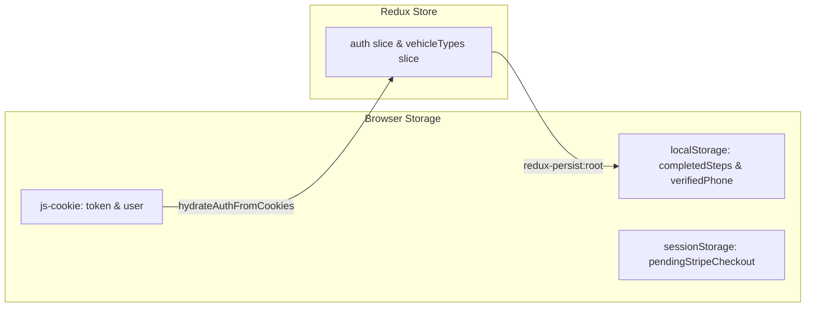
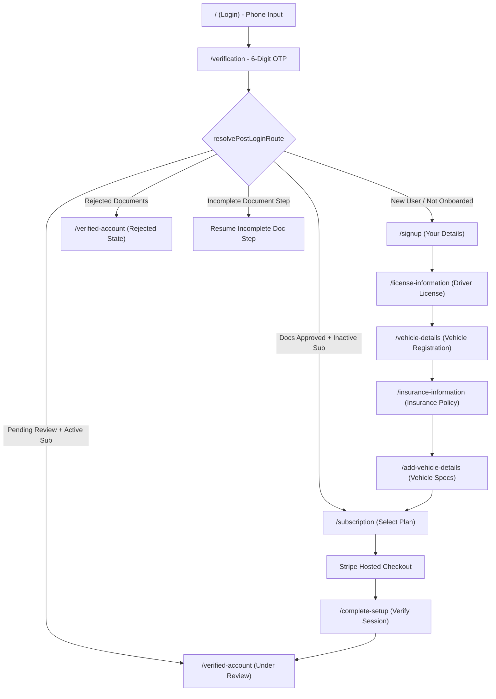
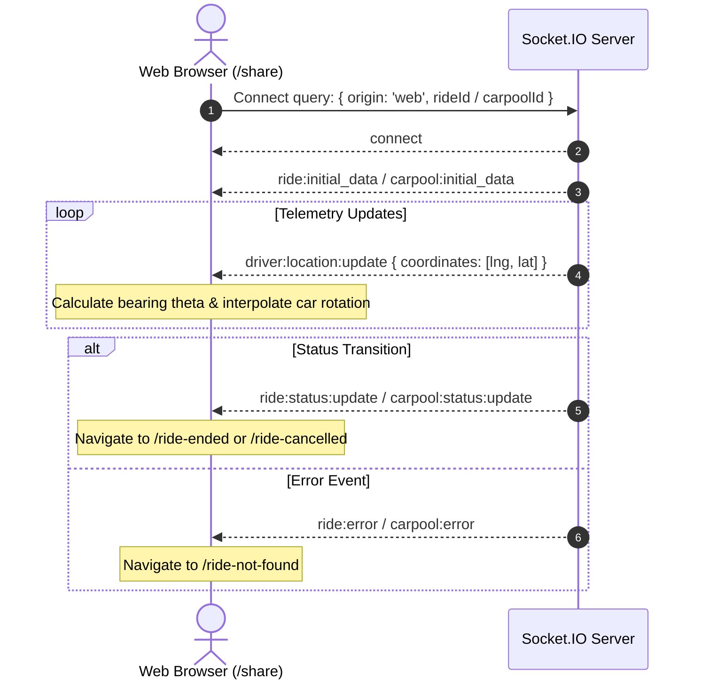

# Epic Rides Web Application — Comprehensive Codebase & Architecture Guide

---

## 1. Executive Summary & Core Mission

**Epic Rides Web App** is the web companion for the Epic Rides ride-hailing and carpooling platform. The web application serves two completely decoupled production surfaces:

1. **Driver Onboarding & Verification Wizard (`/`, `/signup`, `/license-information`, ... `/verified-account`)**
   - End-to-end registration and document upload pipeline for prospective drivers.
   - Phone-based SMS One-Time Password (OTP) authentication.
   - Multi-step document submission wizard (Personal Profile, Driver's License, Vehicle Registration, Auto Insurance, Vehicle Specifications).
   - Strict Florida address restriction enforced via Google Places Autocomplete and geographic coordinate bounding boxes.
   - Dynamic routing engine driven by server-truth document verification and subscription status.
   - Stripe Hosted Checkout integration for recurring driver platform memberships.
   - Real-time status polling for administrative account verification and rejected document resubmission with remote S3 asset pre-filling.

2. **Public Live Ride & Carpool Tracking (`/share`)**
   - Zero-authentication, public-facing live GPS tracking portal accessed via shared deep links.
   - Real-time, bi-directional WebSocket telemetry via Socket.IO.
   - High-precision Google Maps rendering featuring dynamic camera tracking, route polylines, and rotated vehicle markers with heading interpolation.
   - Dual-mode dispatcher supporting single-passenger journeys (`RideTracking.jsx`) and multi-passenger carpool trips (`CarpoolShare.jsx`).
   - Terminal state resolution handling (`/ride-ended`, `/ride-cancelled`, `/ride-not-found`).

> **Important architectural note on template remnants**:
> Directories `src/pages/app`, `src/layouts`, `src/components/layout`, `src/context`, `src/firebase`, `src/hooks/api`, `src/init`, `src/schema`, and `src/static` are inherited from a legacy starter template (`DummyHome`, `DummyLogin`, `DummySidebaar`, commented-out FCM wiring). They are **not active** in production and should not be confused with live application architecture.

---

## 2. Technology Stack & Key Dependencies

### Core Framework & Build Tooling
| Package | Version | Purpose |
|---|---|---|
| `react` | `19.2.4` | Core UI library (concurrent features, hooks) |
| `react-dom` | `19.2.4` | DOM renderer for React |
| `vite` | `6.1.1` | Build system, HMR dev server, Rollup bundler |
| `react-router` | `7.2.0` | Client-side declarative routing (imported as `"react-router"`) |

### State Management & Persistence
| Package | Version | Purpose |
|---|---|---|
| `@reduxjs/toolkit` | `2.11.2` | Global application state, async thunks (`createSlice`, `createAsyncThunk`) |
| `react-redux` | `9.2.0` | React bindings for Redux (`useSelector`, `useDispatch`) |
| `redux-persist` | `6.0.0` | Persists `auth` slice to `localStorage` under key `persist:root` |
| `js-cookie` | `3.0.5` | Cross-origin cookie storage for JWT `token` and `user` JSON (7-day expiry) |

### Networking, Real-Time & Device Intelligence
| Package | Version | Purpose |
|---|---|---|
| `axios` | `1.7.9` | Singleton HTTP client with request/response interceptors |
| `socket.io-client` | `4.8.3` | Real-time WebSocket connection for live telemetry and ride state |
| `@fingerprintjs/fingerprintjs` | `4.6.0` | Browser visitor identification |

### Maps & Geolocation
| Package | Version | Purpose |
|---|---|---|
| Google Maps JavaScript API | Dynamic | Vector map rendering, `AdvancedMarkerElement`, DirectionsService |
| Google Places API | Dynamic | Places Autocomplete loaded imperatively via `loadGoogleMapsPlaces.js` |
| `@react-google-maps/api` | `2.20.8` | Declarative Google Maps React components |

### Styling, Icons & UI Notifications
| Package | Version | Purpose |
|---|---|---|
| `tailwindcss` | `3.4.17` | Utility-first styling framework with PostCSS and Autoprefixer |
| `react-hot-toast` | `2.5.2` | Enforced singleton toast notifications (`Toaster.jsx`) |
| `react-modal` | `3.16.3` | Accessible dialogs with blurred backdrop overlays |
| `lucide-react` | `0.563.0` | Primary vector icon set |
| `react-icons` | `5.5.0` | Secondary icon set (e.g. Ionicons, Game Icons) |
| `@tabler/icons-react` | `3.30.0` | Extended icon set |

---

## 3. Directory Structure & File Map

```
Epic-Rides-Web-App/
├── public/                                 # Public static assets & favicon
├── src/
│   ├── assets/                             # SVGs, vehicle silhouettes, badges, backgrounds
│   │   ├── cars/                           # Vehicle artwork (sedan.png, SUV.png, trackingcar.png, trackcar2.svg)
│   │   ├── login/                          # Login background wallpaper, US flag badge, SVG logo groups
│   │   ├── signup/                         # Stepper indicator bars (barone.png, bartwo.png, barthree.png)
│   │   └── export.js                       # Centralized asset export module
│   ├── components/
│   │   ├── authentication/
│   │   │   ├── SignupBackground.jsx        # Glassmorphic full-screen wrapper with glowing radial gradients
│   │   │   └── SignupSidebar.jsx           # Responsive 5-step progress indicator (mobile bar + desktop sidebar)
│   │   ├── global/
│   │   │   ├── AddCardModal.jsx            # Credit card entry modal
│   │   │   ├── ImageFileInputs.jsx         # Mobile camera vs file gallery input components
│   │   │   ├── LogoutModal.jsx             # Confirmation dialog for logging out
│   │   │   ├── NoInternet.jsx              # Offline screen fallback
│   │   │   ├── NumberVerifiedModal.jsx     # OTP success animation modal
│   │   │   ├── PrivacyPolicyModal.jsx      # Embedded privacy policy viewer
│   │   │   ├── TermsAndConditionsModal.jsx # Embedded terms and conditions viewer
│   │   │   ├── Toaster.jsx                 # Single-instance toast engine (Success, Error, Warning)
│   │   │   └── TopRightLogoutButton.jsx    # Standardized fixed header logout button
│   │   └── layout/                         # [Template Remnant] DummyNavbar.jsx, DummySidebaar.jsx
│   ├── lib/
│   │   ├── helpers.js                      # Placeholder helper utilities
│   │   └── utils.js                        # Error handler (processError) & auth navigation helpers
│   ├── pages/
│   │   ├── authentication/                 # Live Driver Onboarding & Verification Flow
│   │   │   ├── Login.jsx                   # Route /: Phone number entry & SMS OTP request
│   │   │   ├── Verification.jsx            # Route /verification: 6-digit OTP verification & route dispatcher
│   │   │   ├── Signup.jsx                  # Route /signup: Profile creation & Florida-restricted address
│   │   │   ├── LicenseInformation.jsx      # Route /license-information: Driver license upload & metadata
│   │   │   ├── VehicleDetails.jsx          # Route /vehicle-details: Vehicle registration document upload
│   │   │   ├── InsuranceInformation.jsx    # Route /insurance-information: Auto insurance policy document upload
│   │   │   ├── AddVehicleDetails.jsx       # Route /add-vehicle-details: Vehicle specifications & VIN verification
│   │   │   ├── Subscription.jsx            # Route /subscription: Membership plan selection & Stripe launch
│   │   │   ├── Completesetup.jsx           # Route /complete-setup: Stripe checkout return & status validator
│   │   │   └── VerifiedAccount.jsx         # Route /verified-account: Application review & rejected resubmit hub
│   │   ├── tracking/                       # Public Real-Time GPS Tracking Subsystem
│   │   │   ├── ShareTracking.jsx           # Route /share: Dispatcher routing to RideTracking vs CarpoolShare
│   │   │   ├── RideTracking.jsx            # Dedicated single-passenger live tracking map & telemetry
│   │   │   ├── CarpoolShare.jsx            # Multi-passenger, multi-stop carpool live tracking map
│   │   │   ├── RideEnded.jsx               # Route /ride-ended: Animated celebratory particle screen
│   │   │   ├── RideCancelled.jsx           # Route /ride-cancelled: Ride cancellation notification
│   │   │   └── RideNotFound.jsx            # Route /ride-not-found: 404 / expired link notice
│   │   ├── app/                            # [Template Remnant] DummyHome.jsx
│   │   └── NotFound.jsx                    # Route *: Global 404 catch-all screen with sci-fi grid
│   ├── redux/
│   │   ├── slices/
│   │   │   ├── auth.slice.jsx              # All onboarding async thunks, token storage & session reducers
│   │   │   └── vehicleTypes.slice.jsx      # Fetch vehicle types from GET /api/admin/vehicle-types
│   │   └── store.jsx                       # Redux store with redux-persist configuration
│   ├── utils/
│   │   ├── imageFileInput.js               # Native camera/gallery input accept mime-type constants
│   │   ├── loadGoogleMapsPlaces.js         # Imperative Google Places JavaScript API script loader
│   │   ├── onboardingRedirect.js           # Server-truth routing logic & document state analysis
│   │   ├── rejectedFlowPrefill.js          # S3 asset pre-filler converting remote URLs to File objects
│   │   ├── stepValidation.js               # LocalStorage client-side stepper progress guards
│   │   └── subscriptionCheckout.js         # SessionStorage Stripe checkout hand-off keys & helpers
│   ├── App.jsx                             # Top-level route declarations
│   ├── axios.js                            # Axios singleton, baseUrl switching, request/response interceptors
│   ├── index.css                           # Tailwind CSS imports, custom scrollbars, Google autocomplete theme
│   └── main.jsx                            # Application root mount, Redux Provider, ToasterContainer
├── docs/
│   └── PROJECT_DOCUMENTATION.md            # This comprehensive architectural reference
├── CLAUDE.md                               # Operational instructions for AI coding assistants
├── Epic Rides.postman_collection 9.json    # Full backend API reference
├── eslint.config.js                        # ESLint flat configuration
├── tailwind.config.js                      # Tailwind theme extensions (fonts: Poppins, Inter)
├── vercel.json                             # Vercel SPA client-side routing rewrites
└── vite.config.js                          # Vite configuration with React plugin
```

---

## 4. Network Layer & API Architecture (`src/axios.js`)

### Base URL Configuration
The API base URL is declared as an exported constant at the top of [src/axios.js](file:///c:/Users/Muhammad%20Kamil%20Raza/Desktop/KamilRaza/Projects/EpicRides/Epic-Rides-Web-App/src/axios.js):
```javascript
// export const baseUrl = "https://api.dev.epicridesapp.com";
export const baseUrl = "https://api.staging.epicridesapp.com";
// export const baseUrl = "https://api.epicridesapp.com";
// export const baseUrl = "https://kv6hzw0r-3001.inc1.devtunnels.ms";
// export const baseUrl = "https://155e-45-199-187-86.ngrok-free.app";
```
> [!IMPORTANT]
> The backend base URL is **hardcoded** in `src/axios.js`. Even though `.env` contains `VITE_API_BASE_URL`, the application does not read `import.meta.env.VITE_API_BASE_URL`. Switching backend environments is done by uncommenting the appropriate line in `src/axios.js`.

### Request Interceptor & Cross-Origin Auth
Because the web app and the backend API run on different host domains, browser cookies are not passed automatically. The request interceptor inspects `Cookies.get("token")` and attaches it via HTTP `Authorization: Bearer <token>`:
```javascript
instance.interceptors.request.use(
  (config) => {
    const token = Cookies.get("token");
    if (token) {
      config.headers.Authorization = `Bearer ${token}`;
    }
    return config;
  },
  (error) => Promise.reject(error),
);
```

### Response Interceptor & 401 Session Shield
1. **Network Offline / Timeout Interception**:
   - Catches connection timeouts (`ECONNABORTED`, `ETIMEDOUT`, or messages with "timeout") and displays a standardized single-instance `ErrorToast("The request timed out. Please try again.")`.
   - Checks `navigator.onLine` and notifies user when internet connection is degraded.
2. **401 Unauthorized Protection**:
   - An **onboarding route whitelist** ensures that a 401 during registration or document upload does not prematurely kick out prospective drivers:
     ```javascript
     const onboardingPaths = [
       "/signup",
       "/license-information",
       "/vehicle-details",
       "/insurance-information",
       "/add-vehicle-details",
       "/subscription",
       "/verified-account",
       "/verification",
       "/complete-setup",
     ];
     ```
   - If a request specifies `{ skipAuthRedirect: true }`, 401 redirects are skipped.
   - For all other authenticated calls, a 401 clears `token` and `user` cookies, flashes `"Session expired. Please relogin"`, and performs a hard redirect to `/`.

---

## 5. State Management & Session Architecture

### Session State Triplication
Session state is distributed across three storage layers, each serving a specific lifecycle requirement:



1. **HTTP Cookies (`js-cookie`)**:
   - `token`: JWT string with a 7-day TTL.
   - `user`: Serialized user object JSON with a 7-day TTL.
   - `referredBy`: Referral code captured from URL query parameters with a 30-day TTL.
   - *Role*: The durable source of truth that survives tab reloads and cross-origin navigations.
2. **Redux Store (`src/redux/store.jsx`)**:
   - Manages `auth` and `vehicleTypes`.
   - Configured with `redux-persist` saving to `localStorage` under key `root`.
   - Action `hydrateAuthFromCookies` restores Redux state from cookies if the store is empty upon navigation.
   - *Note*: `persistor` is exported but `PersistGate` is not mounted in `main.jsx`.
3. **Storage Utilities (`localStorage` / `sessionStorage`)**:
   - `localStorage.verifiedPhone`: Stores sanitized phone number upon successful OTP verification.
   - `localStorage.completedSteps`: Stores array of completed step identifiers (`step1_signup`, `step2_license`, etc.).
   - `sessionStorage.pendingStripeCheckout`: Flag indicating an active Stripe checkout redirect is in progress.
   - `sessionStorage.postSubscriptionFlow`: Preserves wizard state across the Stripe checkout external redirect.

### Core Redux Thunks (`src/redux/slices/auth.slice.jsx`)

All onboarding document uploads hit the unified endpoint `POST /api/auth/onboard/driver/:driverId/documents?step=N` with `multipart/form-data`:

| Thunk Name | HTTP Endpoint | Payload / Form Data | Purpose |
|---|---|---|---|
| `sendOtp` | `POST /api/auth/send-otp` | `{ phone, role: "driver" }` | Sends 6-digit SMS verification code |
| `verifyOtp` | `POST /api/auth/verify-otp` | `{ phone, otp, role: "driver" }` | Validates OTP, saves `token` & `user` to cookies |
| `onboard` | `POST /api/auth/onboard/driver` | `FormData` (file, name, email, phone, ssn, address, city, state, referredBy) | Creates initial driver account |
| `uploadDriverDocuments` | `POST /api/auth/onboard/driver/:id/documents?step=1` | `FormData` (files [front, back], licenseNumber, expiryDate) | Uploads Driver License images & details |
| `uploadVehicleRegistrationDocuments` | `POST /api/auth/onboard/driver/:id/documents?step=2` | `FormData` (files [front]) | Uploads Vehicle Registration document image |
| `uploadInsuranceDocuments` | `POST /api/auth/onboard/driver/:id/documents?step=3` | `FormData` (files [front, back]) | Uploads Auto Insurance policy documents |
| `uploadVehicleDetails` | `POST /api/auth/onboard/driver/:id/documents?step=4` | `FormData` (make, model, yearOfManufacture, color, VIN, licensePlateNumber, regionOfRegistration, expiryDate, vehicleType) | Uploads vehicle specifications & VIN |

---

## 6. Driver Onboarding Wizard Specification

### Document Status Model
Each document entity (`driverLicense`, `vehicleRegistration`, `insurance`, `vehicleDetails`) has four potential statuses:
- `absent`: Never uploaded.
- `pending`: Uploaded by driver; awaiting administrative approval.
- `approved`: Accepted by admin.
- `rejected`: Rejected by admin; contains `rejectReason` requiring driver correction.

### Step Flow Architecture



### Visual 5-Step Sidebar vs Logical 7-Step Route Mapping
The user-facing UI displays a 5-step progress indicator via `SignupSidebar.jsx`, where Step 3 aggregates three separate document pages:

| Sidebar Step | Step Name | Route | Purpose | Sub-step Asset |
|---|---|---|---|---|
| Step 1 | Your Details | `/signup` | Profile, Florida address, SSN | N/A |
| Step 2 | License Information | `/license-information` | Driver license front & back | N/A |
| Step 3 | Vehicle Details | `/vehicle-details` | Vehicle registration document | `barone.png` (1/3) |
| Step 3 | Vehicle Details | `/insurance-information` | Auto insurance policy front & back | `bartwo.png` (2/3) |
| Step 3 | Vehicle Details | `/add-vehicle-details` | Vehicle make, model, VIN, plate | `barthree.png` (3/3) |
| Step 4 | Subscription | `/subscription` | Platform membership plan | N/A |
| Step 5 | Verified Account | `/verified-account` | Application status & review | N/A |

### Detailed Step Specifications

#### 1. Phone Authentication (`Login.jsx`, `/`)
- Formats input as US telephone number `(XXX) XXX-XXXX`.
- Requires exactly 10 digits; prepends country code `1` before dispatching `sendOtp`.
- Captures `?referredBy=` query parameter and stores in cookies for 30 days.

#### 2. OTP Verification (`Verification.jsx`, `/verification`)
- 6-digit numeric input with auto-advance and clipboard paste support.
- 60-second countdown timer for resending OTP.
- On success: saves `cleanPhone` to `localStorage.verifiedPhone`.
- Evaluates `resolvePostLoginRoute` and redirects immediately to the appropriate onboarding step.

#### 3. Personal Profile (`Signup.jsx`, `/signup`)
- Profile photo with dual-action picker: native camera capture or gallery selection.
- Name fields: alphabetic characters only, maximum 15 characters.
- Strict Florida address restriction:
  - Google Places Autocomplete biased to Florida bounding coordinates (`24.396308, -87.634938` to `31.000968, -79.974306`).
  - Strict validation rejects addresses outside Florida (e.g., "Florida, NY").
  - Automatically extracts and locks City and State when selected via Places Autocomplete.
- US Social Security Number (SSN) formatted as `XXX-XX-XXXX`.
- Terms of Service and Privacy Policy interactive modals.

#### 4. Driver's License (`LicenseInformation.jsx`, `/license-information`)
- Front and back image uploads (Max 5MB; JPG, PNG, HEIC/HEIF, WEBP).
- License number validation: 6-15 alphanumeric characters.
- Expiration date: must be at least 1 month in the future.

#### 5. Vehicle Registration (`VehicleDetails.jsx`, `/vehicle-details`)
- Single registration document photo upload (Max 5MB; JPG, PNG, HEIC/HEIF, WEBP).

#### 6. Auto Insurance (`InsuranceInformation.jsx`, `/insurance-information`)
- Front and back image uploads of current insurance card/policy.

#### 7. Vehicle Specifications (`AddVehicleDetails.jsx`, `/add-vehicle-details`)
- Dynamic vehicle categories loaded from `GET /api/admin/vehicle-types`.
- Make, Model, Color.
- Year of manufacture: restricted to vehicles manufactured within the last 15 years.
- 17-character VIN verification (strict alphanumeric excluding letters I, O, and Q).
- State/Region and License Plate number (1-7 uppercase alphanumeric characters).
- Registration expiration date (future date validation).

#### 8. Subscription (`Subscription.jsx`, `/subscription`)
- Fetches active plans from `GET /api/plan`.
- Dispatches purchase intent to `POST /api/subscription/purchase/:planId/:driverId`.
- Preserves flow state in `sessionStorage` before navigating to the external Stripe Checkout session.

#### 9. Stripe Return (`Completesetup.jsx`, `/complete-setup`)
- Validates return parameters (`session_id`, `canceled`).
- Checks driver subscription status via `GET /api/subscription/details/:driverId`.
- On success: clears checkout session flags, flags `STEPS.SUBSCRIPTION` complete, and navigates to `/verified-account`.
- On cancel/failure: navigates back to `/subscription`.

#### 10. Verification Hub & Rejected Resubmission (`VerifiedAccount.jsx`, `/verified-account`)
- Polls `GET /api/auth/account-status/:driverId` every 10 seconds.
- **Submitted State**: Shows animated "Profile Under Review" screen.
- **Approved State**: Renders approval confirmation.
- **Rejected State**: Displays detailed administrative rejection reasons for each rejected document and presents a "Resubmit Documents" action.
- **Resubmission Flow**:
  - Computes the list of rejected documents.
  - Utilizes `fetchUrlAsFile` (`src/utils/rejectedFlowPrefill.js`) to download existing valid assets from S3 as `File` objects so unchanged documents do not need to be re-uploaded.
  - Calls `clearRejectedFlowState` on Redux upon successful resubmission to transition the UI back to review status.

---

## 7. Public Real-Time Ride & Carpool Tracking Subsystem

The tracking subsystem is publicly accessible at `/share` without authentication.

### Dispatcher (`ShareTracking.jsx`)
- Inspects query parameters:
  - If `?carpool=...` is present: mounts `CarpoolShare.jsx`.
  - Otherwise: mounts `RideTracking.jsx`.

### WebSocket Protocol Architecture



### Shared & Dedicated Socket Events

| Socket Event | Direction | Payload Structure | Handler Action |
|---|---|---|---|
| `ride:initial_data` | Server → Client | `{ data: { ride } }` | Initializes route points, pickup/dropoff, driver & passenger profile |
| `carpool:initial_data` | Server → Client | `{ data: { carpool } }` | Initializes multi-stop waypoints, passenger manifests, and bookings |
| `driver:location:update` | Server → Client | `{ coordinates: [lng, lat] }` | Updates live driver marker position and recalculates heading angle |
| `ride:status:update` | Server → Client | `{ rideStatus: string }` | Updates status badge; navigates to `/ride-ended` or `/ride-cancelled` |
| `carpool:status:update` | Server → Client | `{ status: string }` | Updates carpool status; triggers terminal transitions |
| `carpool:route:update` | Server → Client | `{ stop: object, status: string }` | Updates waypoint and stop arrival status |
| `carpool:route_update` | Server → Client | Multi-format payload | Handles immediate status updates without page reload |
| `carpool:passenger_picked_up` | Server → Client | `{ passengerId: string }` | Updates passenger badge to picked up |
| `carpool:passenger:pickup:confirmed` | Server → Client | Passenger-specific pickup event | Marks active viewer as picked up |
| `carpool:passenger:dropped_off` | Server → Client | Passenger-specific dropoff event | Updates passenger dropoff status |
| `ride:error` / `carpool:error` | Server → Client | `{ message: string }` | Triggers error toast and redirects to `/ride-not-found` |

### Map Telemetry & Rotation Math
- Uses Google Maps JavaScript API with vector map capability (`mapId`).
- Calculates vehicle bearing between previous position $(\phi_1, \lambda_1)$ and new GPS coordinates $(\phi_2, \lambda_2)$:
  $$\theta = \operatorname{atan2}\left(\sin(\Delta\lambda)\cos(\phi_2),\; \cos(\phi_1)\sin(\phi_2) - \sin(\phi_1)\cos(\phi_2)\cos(\Delta\lambda)\right)$$
- Converts bearing $\theta$ from radians to degrees, normalized to $[0, 360^\circ)$.
- Applies smooth rotation to the vehicle marker using `requestAnimationFrame`.
- Computes turn-by-turn driving routes via `google.maps.DirectionsService` with polyline fallback.

---

## 8. Backend API Reference Matrix

The following reference is derived from both the codebase thunks and `Epic Rides.postman_collection 9.json`:

| Category | Method | Endpoint | Auth | Request Body | Description |
|---|---|---|---|---|---|
| **Auth** | `POST` | `/api/auth/send-otp` | Public | JSON `{ phone, role }` | Requests SMS verification code |
| **Auth** | `POST` | `/api/auth/verify-otp` | Public | JSON `{ phone, otp, role }` | Validates code; returns token & user profile |
| **Auth** | `POST` | `/api/auth/onboard/:role` | Public | FormData (file, name, email, phone, ssn, address, city, state, referredBy) | Creates initial driver profile |
| **Auth** | `POST` | `/api/auth/onboard/driver/:id/documents?step=1` | Public | FormData (files [front, back], licenseNumber, expiryDate) | Uploads driver license documents |
| **Auth** | `POST` | `/api/auth/onboard/driver/:id/documents?step=2` | Public | FormData (files [front]) | Uploads vehicle registration document |
| **Auth** | `POST` | `/api/auth/onboard/driver/:id/documents?step=3` | Public | FormData (files [front, back]) | Uploads auto insurance policy documents |
| **Auth** | `POST` | `/api/auth/onboard/driver/:id/documents?step=4` | Public | FormData (make, model, year, color, VIN, plate, region, expiry, vehicleType) | Uploads vehicle specifications |
| **Auth** | `GET` | `/api/auth/account-status/:driverId` | Bearer | None | Fetches real-time driver review/approval status |
| **Auth** | `POST` | `/api/auth/logout` | Bearer | None | Invalidates driver session |
| **Admin** | `GET` | `/api/admin/vehicle-types` | Bearer | None | Fetches allowable vehicle categories |
| **Plan** | `GET` | `/api/plan` | Public | None | Lists available driver membership subscription plans |
| **Subscription** | `POST` | `/api/subscription/purchase/:planId` | Bearer | None | Creates Stripe checkout session for plan |
| **Subscription** | `GET` | `/api/subscription/details/:driverId` | Bearer | None | Retrieves driver subscription status |
| **Subscription** | `POST` | `/api/subscription/cancel/:driverId` | Bearer | None | Cancels active platform membership |

---

## 9. Environment Variables & Runtime Configuration

### `.env` File Reference
Create or configure `.env` in the repository root:
```env
# Google Maps JavaScript API key for vector maps & Places autocomplete
VITE_GOOGLE_MAPS_API_KEY=AIzaSy...

# Google Maps Vector Map ID (required for AdvancedMarkerElement)
VITE_GOOGLE_MAP_ID=AIzaSy...

# Backend API base URL (Note: src/axios.js currently overrides this with a hardcoded constant)
VITE_API_BASE_URL=https://api.staging.epicridesapp.com/
```

### Build & Scripts Reference
```bash
# Start Vite development server (http://localhost:5173)
npm run dev

# Compile production bundle to /dist
npm run build

# Run ESLint across entire project
npm run lint

# Preview built production distribution locally
npm run preview
```

---

## 10. Codebase Health, ESLint Audit & Known Technical Debt

### ESLint Status Audit
Running `npm run lint` identifies 120 issues (109 errors, 11 warnings):

1. **React 19 Unused Import (`no-unused-vars`)**:
   - `import React from 'react';` is flagged in files where `React.` is not directly referenced (due to React 19 automatic JSX runtime).
2. **Unused Variables & Imports in Production Code**:
   - `handleBack` in `VehicleDetails.jsx` and `InsuranceInformation.jsx`.
   - `Check`, `isStepCompleted` in `Subscription.jsx`.
   - `otpSent` in `Verification.jsx`.
   - `Phone`, `MessageCircle`, `furtherCarpoolStatus`, `statusRenderKey` in `CarpoolShare.jsx`.
   - `Phone`, `MessageCircle`, `progress`, `setProgress` in `RideTracking.jsx`.
   - `index` parameter in `src/redux/slices/auth.slice.jsx` line 191.
3. **Unescaped Quotes in JSX (`react/no-unescaped-entities`)**:
   - Unescaped double quotes (`"`) inside JSX text in `LicenseInformation.jsx` (lines 623, 713) and `InsuranceInformation.jsx` (lines 399, 472).
4. **Regular Expression Issues in `Signup.jsx`**:
   - `no-useless-escape`: Unnecessary escape of `/` on line 32.
   - `no-misleading-character-class`: Emoji character range regex on line 33.
5. **Template Boilerplate Remnants**:
   - The majority of the remaining errors reside in `src/pages/app/DummyHome.jsx`, `src/pages/authentication/DummyLogin.jsx`, `src/layouts/`, and `src/hooks/api/`.

### Architectural Debt & Recommended Cleanups
1. **Base URL Parameterization**:
   - `src/axios.js` should read `import.meta.env.VITE_API_BASE_URL` with a fallback instead of requiring manual code edits to switch environments.
2. **Redux PersistGate**:
   - `persistor` is exported from `src/redux/store.jsx` but not mounted in `main.jsx` with `<PersistGate persistor={persistor}>`. Mounting it will ensure rehydrated state is ready before initial render.
3. **Device Fingerprinting Deduplication**:
   - `getDeviceFingerprint` is defined in `src/axios.js` but never exported or referenced. It should either be wired into auth thunks or removed.
4. **Bundle Code-Splitting**:
   - Vite produces a warning during build because the main vendor chunk exceeds 500 kB (683 kB minified). Adding Rollup manual chunks for `@react-google-maps/api`, `socket.io-client`, and `@reduxjs/toolkit` will optimize initial load times.

---

## 11. Developer Onboarding & Future Work Guidelines

When starting new feature development or bug fixes on this repository, observe the following rules:

1. **Do Not Touch Boilerplate**: Avoid refactoring or importing from `src/pages/app`, `src/layouts`, `src/context`, or `src/hooks/api` unless explicitly migrating or removing them.
2. **Preserve Decoupling Between RideTracking and CarpoolShare**: `RideTracking.jsx` and `CarpoolShare.jsx` are intentionally kept separate to prevent regression in single-ride telemetry when tuning carpool multi-stop logic.
3. **Always Route via `resolvePostLoginRoute`**: Do not create ad-hoc routing decisions after login or OTP verification. Update `src/utils/onboardingRedirect.js` so that all post-login destinations remain synchronized with server truth.
4. **Update Onboarding Whitelist for New Steps**: Any new onboarding route must be added to `onboardingPaths` in `src/axios.js` to avoid unexpected 401 logouts during wizard progression.
5. **Respect Florida-Only Geofencing**: Any modification to driver addresses must maintain the Florida bounding box restriction and Florida state validation regex.
